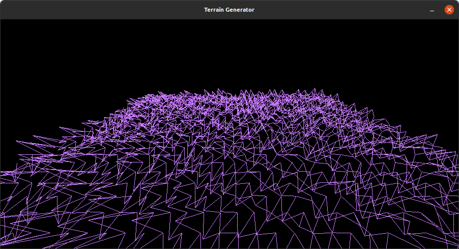

# Terrain Generator

Terrain Generation in C++ using raylib and libnoise.




## Build and installation

#### Install required dependencies
In order to build program, firstly you need to install [raylib](https://github.com/raysan5/raylib/wiki/Working-on-GNU-Linux). After that, you can install required libraries.

##### Ubuntu
```bash
$ sudo apt install libopenal-dev libglfw3-dev libnosie-dev
```


#### Install & Build program

In order to install and build terrain generator:

##### Ubuntu
```bash
$ git clone https://github.com/bacimen/terrain-generator.git terrain-gen
$ cd terrain-gen
$ make
$ make run
```

And the program should run without any problems.
